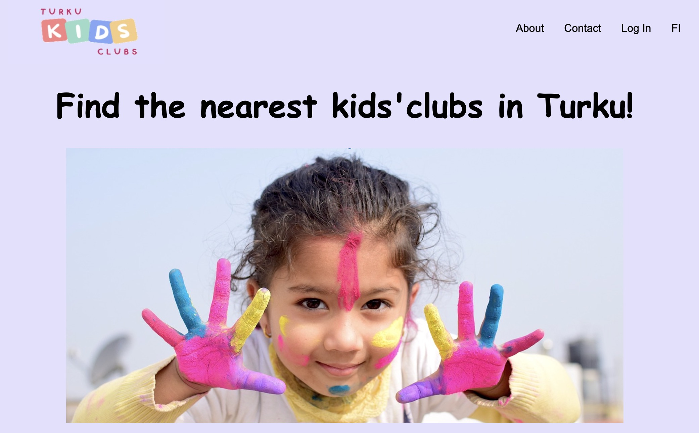
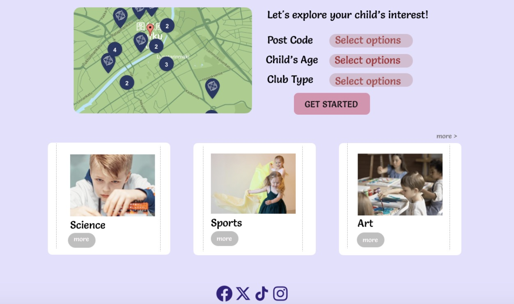

# Turku Kids Interest Club Search (Django Web App)

This project is a web application designed to help parents in Turku find suitable hobby and interest clubs for their children. The platform allows customized search based on the child's age, interests, and postal code, making it easier to discover relevant activities. It was built using Django as part of an academic full-stack web development project.

---

## 🎯 Target Users

- Parents in the Turku area looking for hobby clubs for their children.
- Finnish language learners and educators seeking categorized interest resources.

---

## 💡 Key Features

- 🔎 Search for clubs by **age**, **interest category**, and **postal code**
- 📍 Display of club details, including **contact info**, **location**, and **description**
- 🧩 User-friendly interface with dropdowns and checkboxes
- 🗂️ Categorized directory of kids' clubs
- 📱 Responsive design (PC and mobile compatible)
- 🗺️ Map-based club visualization (planned)

---

## 🛠 Tech Stack

- **Backend:** Django, Python
- **Frontend:** HTML, CSS, Bootstrap, JavaScript
- **Database:** SQLite (development mode)
- **Design tools:** Figma, Adobe Photoshop
- **IDE:** Visual Studio Code, PyCharm

---

## 🧱 Project Structure

```
tkc_project/           # Django project config
├── user_accounts/     # Custom user models and login
├── hobby_clubs/       # Club models, views, search logic
├── static/            # CSS, JS, image assets
├── templates/         # HTML templates
└── manage.py
```

---

## 🚀 How to Run (Local Setup)

1. Clone the repository:
   ```bash
   git clone https://github.com/yourname/turku-kids-club.git
   cd turku-kids-club
   ```

2. Create and activate a virtual environment:
   ```bash
   python3 -m venv tkc_env
   source tkc_env/bin/activate
   ```

3. Install dependencies:
   ```bash
   pip install -r requirements.txt
   ```

4. Run migrations and start server:
   ```bash
   python manage.py migrate
   python manage.py runserver
   ```

5. Open your browser and visit:
   ```
   http://127.0.0.1:8000/
   ```

---

## 📷 Screenshots




---

## 📈 Development Methodology

- Adopted **MVP approach** – built core search/filter features first
- Used **Agile workflow**, collaborative version control via GitHub
- Conducted unit, integration, and usability testing
- Future plans: full map integration, user registration, data import tool

---

## 👩‍💻 Author & Background

Developed by Jiao Chen, ICT + AI student at Turku University of Applied Sciences.  
This project was inspired by the real-life need to find suitable clubs for my child in Turku and built to address that gap for local families.

---

## 📬 Contact

For questions or collaboration, feel free to reach out via GitHub or jiao.chen@edu.turkuamk.fi.
